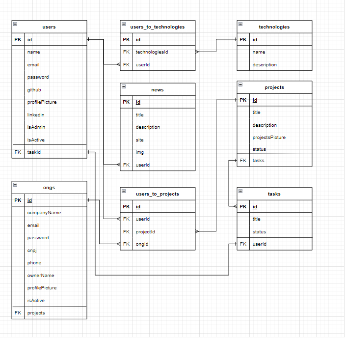

# DeVolunteer-API

# Documentação da API

- Link da API: https://raphaeldamasceno1852.github.io/DeVolunteer-Doc/

## Tabela de Conteúdos

- [Visão Geral](#1-visão-geral)
- [Diagrama ER](#2-diagrama-er)
- [Início Rápido](#3-início-rápido)
    - [Instalando Dependências](#31-instalando-dependências)
    - [Variáveis de Ambiente](#32-variáveis-de-ambiente)
    - [Migrations](#33-migrations)
- [Autenticação](#4-autenticação)
- [Endpoints](#5-endpoints)

---

## 1. Visão Geral

Visão geral do projeto, um pouco das tecnologias usadas.

- [NodeJS](https://nodejs.org/en/)
- [Express](https://expressjs.com/pt-br/)
- [TypeScript](https://www.typescriptlang.org/)
- [PostgreSQL](https://www.postgresql.org/)
- [TypeORM](https://typeorm.io/)
- [Yup](https://www.npmjs.com/package/yup)

A URL base da aplicação:
https://devolunteer.onrender.com

---

## 2. Diagrama ER
[ Voltar para o topo ](#tabela-de-conteúdos)


Diagrama ER da API definindo bem as relações entre as tabelas do banco de dados.



---

## 3. Início Rápido
[ Voltar para o topo ](#tabela-de-conteúdos)


### 3.1. Instalando Dependências

Clone o projeto em sua máquina e instale as dependências com o comando:

```shell
yarn
```

### 3.2. Variáveis de Ambiente

Em seguida, crie um arquivo **.env**, copiando o formato do arquivo **.env.example**:
```
cp .env.example .env
```

Configure suas variáveis de ambiente com suas credenciais do Postgres e uma nova database da sua escolha.

### 3.3. Migrations

Execute as migrations com o comando:

```
yarn typeorm migration:run -d src/data-source.ts
```

---
## 4. Autenticação
[ Voltar para o topo ](#tabela-de-conteúdos)

### Índice

- [Login](#1-login)
    - [POST - /login](#11-criação-de-usuário)
---

## 5. Endpoints

[ Voltar para o topo ](#tabela-de-conteúdos)

### Índice

- [Users](#1-users)
    - [POST - /users](#11-criação-de-usuário)
    - [GET - /users](#12-listando-usuários)
	- [PATCH - /users/:user_id](#13-listar-usuário-por-id)
	- [DELETE - /users/:user_id](#13-listar-usuário-por-id)
- [ONGs](#2-ong)
- [News](#3-news)
- [Projects](#4-projects)

---

## 1. **Users**
[ Voltar para os Endpoints ](#5-endpoints)

O objeto User é definido como:

| Campo          | Tipo   | Descrição                                     |
| -------------- |--------| -------------------------------------------------|
| id             | string | Identificador único do usuário                  |
| name           | string | O nome do usuário.                              |
| email          | string | O e-mail do usuário.                            |
| password       | string | A senha de acesso do usuário                    |
| isAdm          | boolean | Define se um usuário é Administrador ou não.   |
| github         | string | Perfil do usuário no github.   |
| linkedin       | string | Perfil do usuário no linkedin.   |
| profilePicture | string | fot de perfil do usuário.   |

### Endpoints

| Método   | Rota       | Descrição                                                 |
|----------|------------|-----------------------------------------------------------|
| POST     | /users     | Criação de um usuário.                                    |
| GET      | /users     | Lista todos os usuários                                   |
| PATCH    | /users/:user_id     | Atualiza um usuário usando seu ID como parâmetro |
| DELETE   | /users/:user_id     | Deleta um usuário usando seu ID como parâmetro   |

---

### 1.1. **Criação de Usuário**

[ Voltar para os Endpoints ](#5-endpoints)

### `/users`

### Exemplo de Request:
```
POST /users
Host: https://devolunteer.onrender.com
Authorization: None
Content-type: application/json
```

### Corpo da Requisição:
```
{
    "name": "Rafael Quadros",
    "email":"rafaelquadros@mail.com",
    "isAdm": true,
    "password": "123456",
    "github": "www.github.com",
    "linkedin": "www.linkedin.com",
    "profilePicture": "https://t.ctcdn.com.br/IVlt3nVuXYDVX4vyjzgborR84H0=/400x400/smart/i490793.jpeg"
}
```

### Schema de Validação com Yup:
```javascript
CreateUserSerializerRequest = yup.object().shape({
  name: yup.string().required(),
  email: yup.string().required(),
  password: yup.string().required(),
  github: yup.string().required(),
  linkedin: yup.string().required(),
  profilePicture: yup.string().required(),
  isAdm: yup.boolean().notRequired(),
  location: yup.string().required(),
});
```
OBS.: Chaves não presentes no schema serão removidas.

### Exemplo de Response:
```
201 Created
```

```json
{
	"location": "Brazil/BR - Minas Gerais/MG - Vespasiano",
	"updatedAt": "2023-01-17T19:41:17.877Z",
	"createdAt": "2023-01-17T19:41:17.877Z",
	"isActive": true,
	"isAdm": true,
	"profilePicture": "https://t.ctcdn.com.br/IVlt3nVuXYDVX4vyjzgborR84H0=/400x400/smart/i490793.jpeg",
	"linkedin": "www.linkedin.com",
	"github": "www.github.com",
	"email": "rafaelquadros@mail.com",
	"name": "Rafael Quadros",
	"id": "8f321719-c27c-4b6d-be59-54091dbe5270"
}
```

### Possíveis Erros:
| Código do Erro | Descrição |
|----------------|-----------|
| 409 Conflict     | Email already registered. |

### 1.2. **Listando Usuários**

[ Voltar aos Endpoints ](#5-endpoints)

### `/users`

### Exemplo de Request:
```
GET /users
Host: https://devolunteer.onrender.com
Authorization: Bearer token
Content-type: application/json
```

### Corpo da Requisição:
```json
Vazio
```

### Exemplo de Response:
```
200 OK
```
```json
[
	{
		"id": "9cda28c9-e540-4b2c-bf0c-c90006d37893",
		"name": "Eduardo",
		"email": "edu@mail.com",
		"isAdm": true
	}
]
```

### Possíveis Erros:
Nenhum, o máximo que pode acontecer é retornar uma lista vazia.

---

### 1.3. **Listar Usuário por ID**

[ Voltar aos Endpoints ](#5-endpoints)

### `/users/:user_id`

### Exemplo de Request:
```
GET /users/9cda28c9-e540-4b2c-bf0c-c90006d37893
Host: https://devolunteer.onrender.com
Authorization: None
Content-type: application/json
```

### Parâmetros da Requisição:
| Parâmetro   | Tipo        | Descrição                             |
|-------------|-------------|---------------------------------------|
| user_id     | string      | Identificador único do usuário (User) |

### Corpo da Requisição:
```json
Vazio
```

### Exemplo de Response:
```
200 OK
```
```json
{
	"id": "9cda28c9-e540-4b2c-bf0c-c90006d37893",
	"name": "Eduardo",
	"email": "edu@mail.com",
	"isAdm": true
}
```

### Possíveis Erros:
| Código do Erro | Descrição |
|----------------|-----------|
| 404 Not Found   | User not found. |


[def]: diagrama.drawio.png